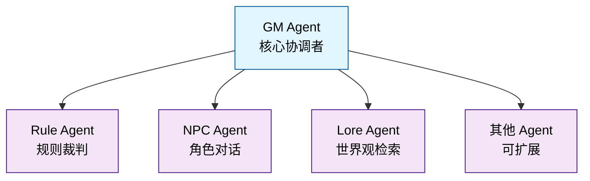

# Astinus

> AI 驱动的叙事向单人 TTRPG 引擎

Astinus 是一个基于 AI 多智能体架构的叙事导向桌面角色扮演游戏引擎，通过自然语言交互提供沉浸式的单人 TTRPG 体验。

## 项目状态

✅ **Phase 7 已完成** - React Web 前端实现已完成
🎯 **下一步** - Phase 8: 多场景管理与剧情节点图

### 最新进展

- ✅ **Phase 1**: 基础设施搭建
- ✅ **Phase 2**: 核心引擎（数据模型、骰子系统、Agent 基础）
- ✅ **Phase 3**: Agent 协作与 API 集成
  - NPC Agent - 基于双层结构的角色对话生成
  - 多 Agent 管线协作（GM、Rule、NPC、Lore）
  - WebSocket 流式输出与实时交互
- ✅ **Phase 4**: 向量检索与增强 JSON 解析
  - VectorStoreService - ChromaDB 向量存储
  - LoreAgent 混合搜索 - 关键词 + 向量语义检索
  - NPC 记忆检索 - 语义检索相关记忆
  - GM 历史检索 - 长游戏对话历史管理
- ⚠️ **Phase 5**: Textual TUI 前端（已弃用）
- ✅ **Phase 6**: 完整游戏体验与部署
  - 前后端集成、WebSocket 消息路由
  - 持久化层、数据库服务、会话管理
  - Agent 协作完善、NPC 状态持久化
  - 集成测试、覆盖率提升至 70%
- ✅ **Phase 7**: React Web 前端
  - React 19 + TypeScript + Vite + TailwindCSS
  - 响应式设计（桌面端 + 移动端）
  - 页面组件 - MenuPage、GamePage、CharacterPage
  - 功能组件 - ChatBox、StatBlock、DiceRoller
  - 状态管理 - Zustand stores
  - 移动端优化 - 底部面板、触摸友好界面

## 快速开始

### 环境要求

- Python >= 3.13
- [uv](https://github.com/astral-sh/uv) - 现代 Python 包管理器
- Node.js >= 18（用于 Web 前端）
- npm 或 yarn（用于 Web 前端）

### 安装

```bash
# 克隆仓库
git clone https://github.com/Rene-Zhou/Astinus.git
cd Astinus

# 安装后端依赖
uv sync

# 安装前端依赖
cd src/web
npm install

# 返回项目根目录
cd ../../

# 复制配置模板
cp config/settings.example.yaml config/settings.yaml
# 编辑 config/settings.yaml 填入你的 API 密钥
```

### 启动开发服务器

```bash
# 启动后端 API 服务器（终端 1）
uv run uvicorn src.backend.main:app --reload --port 8000

# 启动前端开发服务器（终端 2）
cd src/web
npm run dev
```

然后在浏览器中打开 `http://localhost:5173`

### 运行测试

```bash
# 运行后端测试
uv run pytest

# 运行前端测试
cd src/web
npm test

# 运行代码检查
uv run ruff check src/ tests/

# 运行类型检查
uv run mypy src/
```

## 项目结构

```
Astinus/
├── src/
│   ├── backend/         # FastAPI 后端与 AI Agents
│   │   ├── agents/         # 多 Agent 系统（GM、Rule、NPC、Lore）
│   │   ├── api/            # REST API 和 WebSocket 端点
│   │   ├── models/         # 数据模型
│   │   └── services/      # 核心服务（数据库、向量存储等）
│   │
│   ├── web/             # React Web 前端（新增）
│   │   ├── src/
│   │   │   ├── api/           # API 客户端
│   │   │   ├── components/    # 可复用组件
│   │   │   │   ├── ChatBox/
│   │   │   │   ├── StatBlock/
│   │   │   │   ├── DiceRoller/
│   │   │   │   ├── Layout/
│   │   │   │   └── common/
│   │   │   ├── pages/         # 页面组件
│   │   │   ├── stores/        # Zustand 状态管理
│   │   │   └── hooks/         # 自定义 Hooks
│   │   └── public/
│   │
│   └── shared/          # 共享工具
│
├── data/                # 数据存储（世界包、存档、向量库）
├── locale/              # 多语言资源（cn/en）
├── tests/               # 测试套件（后端）
├── config/              # 配置文件
└── docs/                # 项目文档
```

## 文档

- [开发指南](docs/GUIDE.md) - 游戏设计与规则系统
- [架构文档](docs/ARCHITECTURE.md) - 技术架构与 API 设计
- [开发进度](docs/PROGRESS.md) - 项目路线图与待办事项
- [开发规范](CLAUDE.md) - 代码规范与工作流程

## 核心特性

- 🎭 **纯自然语言交互** - 无菜单选项，自由描述行动
- 🖥️ **现代化 Web 界面** - 基于 React 的响应式用户界面
  - 实时聊天窗口，流式显示叙事内容
  - 角色状态面板，动态展示游戏状态
  - 可视化骰子界面，动画掷骰结果
  - 响应式设计，支持桌面和移动端
- 📱 **移动端优化** - 专为移动设备优化的交互体验
  - 底部面板设计，触摸友好的界面
  - 自适应布局，手机平板完美适配
  - 防滚动锁定，流畅的移动体验
- 🤖 **多智能体协作** - GM、NPC、Rule、Lore 等 Agent 分工协作
  - GM Agent - 核心协调者，星型拓扑中心
  - Rule Agent - 规则裁判，生成骰子检定
  - NPC Agent - 角色对话，情感与关系系统
  - Lore Agent - 世界观检索，背景信息提供
- 🧠 **智能向量检索** - ChromaDB 语义搜索
  - Lore 混合搜索：关键词 + 向量语义匹配
  - NPC 记忆检索：语义检索相关记忆
  - GM 历史检索：长游戏对话历史管理
- 🎲 **透明的规则系统** - 基于 2d6 的掷骰机制（掷 2d6，奖励/惩罚骰子取最高/最低 2 枚）
- 📦 **模块化世界包** - 故事内容与引擎解耦，支持扩展
- 🌏 **多语言支持** - 中英双语界面与内容
- ⚡ **实时流式交互** - WebSocket 流式输出，typewriter 效果
- 💾 **持久化存储** - SQLite 存档 + ChromaDB 向量库

## Web 界面预览

Astinus 提供现代化的 Web 界面，可在任何现代浏览器中运行，支持桌面和移动设备：

### 游戏主界面

**桌面端 - 三栏布局**
```
+----------------------+---------------------------+------------------+
|                      |                           |                  |
|    角色状态面板       |        叙事对话窗口         |     骰子面板      |
|                      |                           |                  |
|  • 角色：张伟         |  GM: 你进入了图书馆...      |   [掷骰结果]     |
|  • 概念：冒险者       |                           |   [2d6]         |
|  • 位置：图书馆       |  Player: 我 look around   |                  |
|  • 阶段：等待输入     |                           |   [提交]         |
|  • 回合：5            |  GM: 你看到陈玲在整理古籍   |                  |
|  • 命运点：★★★☆☆      |                           |                  |
|                      |  [需要检定 - 敏捷 DC 15]   |                  |
|                      |                           |                  |
|                      +---------------------------+                  |
|                      |     玩家输入框             |                  |
|                      |  > I try to sneak...     |                  |
+----------------------+---------------------------+------------------+
```

**移动端 - 底部面板设计**
```
+------------------------------------------------+
|                                                |
|              叙事对话窗口                        |
|                                                |
|  GM: 你进入了图书馆，古老的书香扑面而来...       |
|                                                |
|  Player: 我 look around                        |
|                                                |
|  GM: 你看到陈玲在整理古籍，她注意到你...         |
|                                                |
|  [需要检定 - 敏捷 DC 15]                       |
|                                                |
+------------------------------------------------+
|                                                |
|  📊 状态  |  💬 对话  |  🎲 骰子  |  👤 角色  |
|                                                |
|           [玩家输入框 - 触摸友好]               |
|                                                |
+------------------------------------------------+
```

### 主要组件

**桌面端**:
- **左侧状态栏**: 显示角色信息、当前位置、游戏阶段和回合数
- **中间聊天区**: 实时显示 GM 叙事和玩家行动，流式内容输出
- **右侧骰子面板**: 可视化掷骰功能，动画显示结果
- **底部输入区**: 玩家输入框，支持多行文本和历史记录

**移动端**:
- **顶部对话区**: 全屏显示叙事内容，触摸滚动
- **底部工具栏**: 四个标签页（状态、对话、骰子、角色）
- **底部输入框**: 触摸优化的输入区域
- **底部面板**: 从底部滑出的功能面板

### 交互特性

- **响应式设计**: 自动适配不同屏幕尺寸
- **流式输出**: 实时显示 AI 生成的内容，打字机效果
- **触摸优化**: 移动端专门优化的触摸交互
- **动画效果**: 掷骰动画、面板切换动画
- **键盘支持**: 桌面端快捷键，移动端虚拟键盘

## 技术栈

### 后端
- **框架**: FastAPI - 高性能异步 API
- **AI Orchestration**: LangChain - 多提供商模型支持
- **Agent**: 自研多 Agent 协作系统（星型拓扑）
- **实时通信**: WebSocket - 流式响应

### 前端
- **框架**: React 19 - 现代化前端框架
- **语言**: TypeScript - 类型安全
- **构建工具**: Vite - 快速开发体验
- **样式**: TailwindCSS - 实用优先的 CSS 框架
- **状态管理**: Zustand - 轻量级状态管理
- **路由**: React Router v6 - 标准路由解决方案
- **测试**: Vitest + Testing Library - 快速测试

### 数据层
- **结构化数据**: Pydantic models + SQLite
- **向量检索**: ChromaDB - 语义搜索
- **世界包**: JSON 格式，模块化管理

### 开发工具
- **包管理**: uv (后端) + npm (前端)
- **测试**: pytest (后端) + Vitest (前端)
- **代码质量**: ruff + mypy + ESLint
- **类型系统**: Pydantic v2 + TypeScript

## 开发

### 代码质量

项目使用以下工具保证代码质量：

- **后端**:
  - `ruff` - 代码格式化与静态检查
  - `mypy` - 类型检查
  - `pytest` - 单元测试
- **前端**:
  - `ESLint` - 代码质量检查
  - `TypeScript` - 静态类型检查
  - `Vitest` + `Testing Library` - 单元测试与组件测试

### 分支策略

- `main` - 主分支，保持稳定
- `feature/*` - 功能开发分支
- `fix/*` - 问题修复分支

### 提交规范

- 使用清晰的提交信息描述更改
- 重大更新需同步更新 `docs/PROGRESS.md`

## 架构设计

### Agent 星型拓扑



- **信息隔离**: 每个 Agent 只能访问必要的上下文切片
- **职责单一**: 每个 Agent 有明确的职责边界
- **可扩展**: 易于添加新的 Agent 类型

### 上下文切片机制

GM Agent 负责为每个子 Agent 准备精准的上下文切片，确保：
- NPC Agent 不会知道其他 NPC 的信息
- Rule Agent 不会访问游戏历史
- Lore Agent 只获取相关的世界观信息

## 测试与质量保证

### 测试统计

- **总测试数**: 425 个
- **测试覆盖率**: 71%
- **测试类型**:
  - 单元测试 - Agent、模型、核心组件
  - 集成测试 - 多 Agent 协作流程
  - API 测试 - REST 和 WebSocket 端点
  - 前端测试 - TUI 组件和交互（25个测试，100%通过）

### 质量标准

- 所有新功能必须包含测试
- 单元测试覆盖率 > 80%
- 集成测试覆盖率 > 70%
- 前端测试覆盖率 > 70%
- 通过 ruff + mypy 检查

## 贡献指南

欢迎贡献代码！请遵循以下步骤：

1. Fork 本仓库
2. 创建功能分支：`git checkout -b feature/your-feature`
3. 提交更改：`git commit -m 'Add some feature'`
4. 推送分支：`git push origin feature/your-feature`
5. 创建 Pull Request

### 开发工作流

1. 从 `main` 分支创建 feature 分支
2. 遵循 TDD：先写测试，再写实现
3. 确保所有测试通过：`uv run pytest`
4. 运行代码检查：`uv run ruff check`
5. 运行类型检查：`uv run mypy src/`
6. 更新相关文档（包括 README.md 和 PROGRESS.md）

### 运行完整检查

```bash
# 运行后端测试
uv run pytest

# 运行前端测试
cd src/web
npm test

# 代码格式化与检查（后端）
uv run ruff check src/ tests/
uv run ruff format src/ tests/

# 代码检查（前端）
cd src/web
npm run lint

# 类型检查
uv run mypy src/
```

## 许可证

本项目采用 MIT 许可证。详情请见 [LICENSE](LICENSE) 文件。

## 致谢

- 基于 LangChain 构建 AI Agent 系统
- 使用 Textual 打造现代 TUI 体验

## 联系方式

- 项目主页: [GitHub Repository](https://github.com/Rene-Zhou/Astinus)
- 问题反馈: [GitHub Issues](https://github.com/Rene-Zhou/Astinus/issues)
