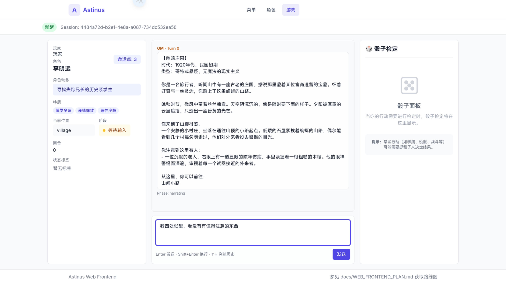
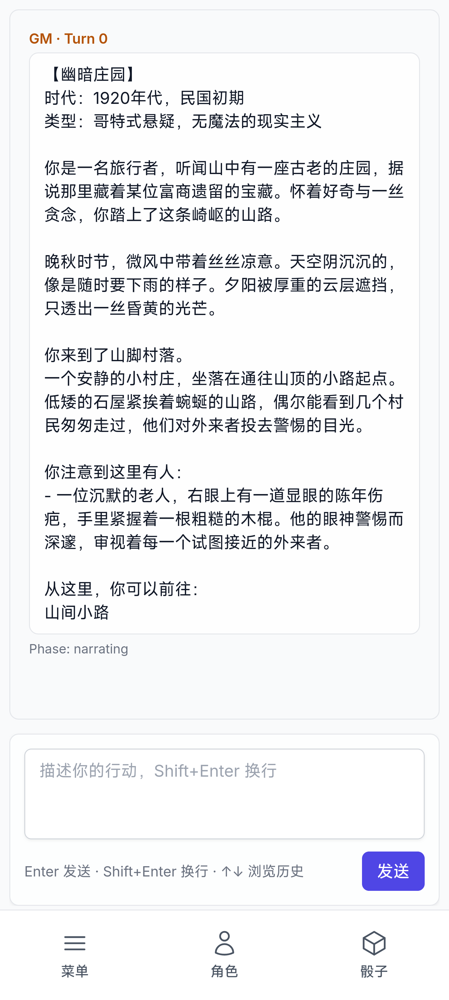
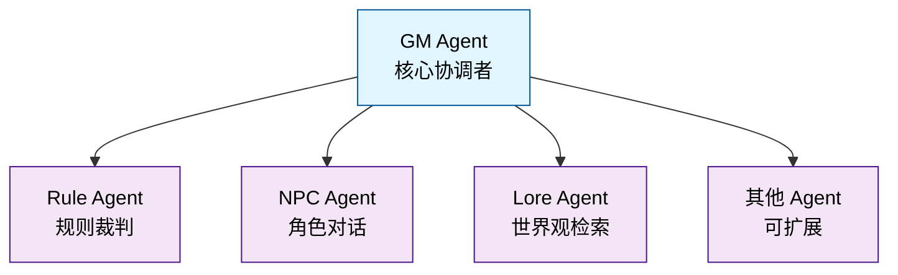

# Astinus

> AI 驱动的叙事向单人 TTRPG 引擎

Astinus 是一个基于 AI 多智能体架构的叙事导向桌面角色扮演游戏引擎，通过自然语言交互提供沉浸式的单人 TTRPG 体验。

## 项目状态

✅ MVP

## 快速开始

### 环境要求

- Python >= 3.13
- [uv](https://github.com/astral-sh/uv) - 现代 Python 包管理器
- Node.js >= 18（用于 Web 前端）
- npm 或 yarn（用于 Web 前端）

### 安装

```bash
# 克隆仓库
git clone https://github.com/Rene-Zhou/Astinus.git
cd Astinus

# 安装后端依赖
uv sync

# 安装前端依赖
cd src/web
npm install

# 返回项目根目录
cd ../../

# 复制配置模板
cp config/settings.example.yaml config/settings.yaml
# 编辑 config/settings.yaml 填入你的 API 密钥
```

### 启动开发服务器

```bash
# 启动后端 API 服务器（终端 1）
uv run uvicorn src.backend.main:app --reload --port 8000

# 启动前端开发服务器（终端 2）
cd src/web
npm run dev
```

然后在浏览器中打开 `http://localhost:5173`

### 运行测试

```bash
# 运行后端测试
uv run pytest

# 运行前端测试
cd src/web
npm test

# 运行代码检查
uv run ruff check src/ tests/

# 运行类型检查
uv run mypy src/
```

## 核心特性

- 🎭 **纯自然语言交互** - 无菜单选项，自由描述行动
- 🖥️ **现代化 Web 界面** - 基于 React 的响应式用户界面
  - 实时聊天窗口，流式显示叙事内容
  - 角色状态面板，动态展示游戏状态
  - 可视化骰子界面，动画掷骰结果
  - 响应式设计，支持桌面和移动端
- 📱 **移动端优化** - 专为移动设备优化的交互体验
  - 底部面板设计，触摸友好的界面
  - 自适应布局，手机平板完美适配
  - 防滚动锁定，流畅的移动体验
- 🤖 **多智能体协作** - GM、NPC、Rule、Lore 等 Agent 分工协作
  - GM Agent - 核心协调者，星型拓扑中心
  - Rule Agent - 规则裁判，生成骰子检定
  - NPC Agent - 角色对话，情感与关系系统
  - Lore Agent - 世界观检索，背景信息提供
- 🧠 **智能向量检索** - ChromaDB 语义搜索
  - Lore 混合搜索：关键词 + 向量语义匹配
  - NPC 记忆检索：语义检索相关记忆
  - GM 历史检索：长游戏对话历史管理
- 🎲 **透明的规则系统** - 基于 2d6 的掷骰机制（掷 2d6，奖励/惩罚骰子取最高/最低 2 枚）
- 📦 **模块化世界包** - 故事内容与引擎解耦，支持扩展
- 🌏 **多语言支持** - 中英双语界面与内容
- ⚡ **实时流式交互** - WebSocket 流式输出，typewriter 效果
- 💾 **持久化存储** - SQLite 存档 + ChromaDB 向量库

## Web 界面预览

Astinus 提供现代化的 Web 界面，可在任何现代浏览器中运行，支持桌面和移动设备：

### 游戏主界面

**桌面端 - 三栏布局**



**移动端 - 底部面板设计**



### 主要组件

**桌面端**:
- **左侧状态栏**: 显示角色信息、当前位置、游戏阶段和回合数
- **中间聊天区**: 实时显示 GM 叙事和玩家行动，流式内容输出
- **右侧骰子面板**: 可视化掷骰功能，动画显示结果
- **底部输入区**: 玩家输入框，支持多行文本和历史记录

**移动端**:
- **顶部对话区**: 全屏显示叙事内容，触摸滚动
- **底部工具栏**: 三个个标签页（菜单、角色、骰子）
- **底部输入框**: 触摸优化的输入区域
- **底部面板**: 从底部滑出的功能面板

## 技术栈

### 后端
- **框架**: FastAPI - 高性能异步 API
- **AI Orchestration**: LangChain - 多提供商模型支持
- **Agent**: 多 Agent 协作系统（星型拓扑）
- **实时通信**: WebSocket - 流式响应

### 前端
- **框架**: React 19 - 现代化前端框架
- **语言**: TypeScript - 类型安全
- **构建工具**: Vite - 快速开发体验
- **样式**: TailwindCSS - 实用优先的 CSS 框架
- **状态管理**: Zustand - 轻量级状态管理
- **路由**: React Router v6 - 标准路由解决方案
- **测试**: Vitest + Testing Library - 快速测试

### 数据层
- **结构化数据**: Pydantic models + SQLite
- **向量检索**: ChromaDB - 语义搜索
- **世界包**: JSON 格式，模块化管理

### 开发工具
- **包管理**: uv (后端) + npm (前端)
- **测试**: pytest (后端) + Vitest (前端)
- **代码质量**: ruff + mypy + ESLint
- **类型系统**: Pydantic v2 + TypeScript

## 架构设计

### Agent 星型拓扑



- **信息隔离**: 每个 Agent 只能访问必要的上下文切片
- **职责单一**: 每个 Agent 有明确的职责边界
- **可扩展**: 易于添加新的 Agent 类型

### 上下文切片机制

GM Agent 负责为每个子 Agent 准备精准的上下文切片，确保：
- NPC Agent 不会知道其他 NPC 的信息
- Rule Agent 不会访问游戏历史
- Lore Agent 只获取相关的世界观信息

## 许可证

本项目采用 MIT 许可证。详情请见 [LICENSE](LICENSE) 文件。

## 致谢

- 基于 LangChain 构建 AI Agent 系统
- 在世界包的构建上，参考了[SillyTavern](https://github.com/SillyTavern/SillyTavern)的设计

## 联系方式

- 项目主页: [GitHub Repository](https://github.com/Rene-Zhou/Astinus)
- 问题反馈: [GitHub Issues](https://github.com/Rene-Zhou/Astinus/issues)
