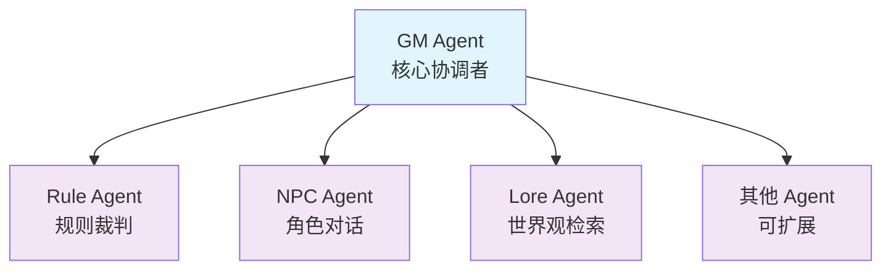

# Astinus

> AI 驱动的叙事向单人 TTRPG 引擎

Astinus 是一个基于 AI 多智能体架构的叙事导向桌面角色扮演游戏引擎，通过自然语言交互提供沉浸式的单人 TTRPG 体验。

## 项目状态

✅ **Phase 3 已完成** - Agent 协作与 API 集成已完成
🚧 **进行中** - Phase 4: Narrative Graph 与世界包开发中

### 最新进展

- ✅ **Phase 1**: 基础设施搭建
- ✅ **Phase 2**: 核心引擎（数据模型、骰子系统、Agent 基础）
- ✅ **Phase 3**: Agent 协作与 API 集成
  - NPC Agent - 基于双层结构的角色对话生成
  - 多 Agent 管线协作（GM、Rule、NPC、Lore）
  - WebSocket 流式输出与实时交互
  - 324 个测试通过，84% 覆盖率
- 🚧 **Phase 4**: Narrative Graph 与世界包（规划中）

## 快速开始

### 环境要求

- Python >= 3.14
- [uv](https://github.com/astral-sh/uv) - 现代 Python 包管理器

### 安装

```bash
# 克隆仓库
git clone <repository-url>
cd Astinus

# 安装依赖
uv sync

# 复制配置模板
cp config/settings.example.yaml config/settings.yaml
# 编辑 config/settings.yaml 填入你的 API 密钥
```

### 运行测试

```bash
# 运行所有测试
uv run pytest

# 运行代码检查
uv run ruff check src/ tests/

# 运行类型检查
uv run mypy src/
```

## 项目结构

```
Astinus/
├── src/
│   ├── backend/         # FastAPI 后端与 AI Agents
│   ├── frontend/        # Textual TUI 前端
│   └── shared/          # 共享工具
├── data/                # 数据存储（世界包、存档、向量库）
├── locale/              # 多语言资源（cn/en）
├── tests/               # 测试套件
├── config/              # 配置文件
└── docs/                # 项目文档
```

## 文档

- [开发指南](docs/GUIDE.md) - 游戏设计与规则系统
- [架构文档](docs/ARCHITECTURE.md) - 技术架构与 API 设计
- [开发进度](docs/PROGRESS.md) - 项目路线图与待办事项
- [开发规范](CLAUDE.md) - 代码规范与工作流程

## 核心特性

- 🎭 **纯自然语言交互** - 无菜单选项，自由描述行动
- 🤖 **多智能体协作** - GM、NPC、Rule、Lore 等 Agent 分工协作
  - GM Agent - 核心协调者，星型拓扑中心
  - Rule Agent - 规则裁判，生成骰子检定
  - NPC Agent - 角色对话，情感与关系系统
  - Lore Agent - 世界观检索，背景信息提供
- 🎲 **透明的规则系统** - 基于 2d6 的简洁掷骰机制
- 📦 **模块化世界包** - 故事内容与引擎解耦，支持扩展
- 🌏 **多语言支持** - 中英双语界面与内容
- ⚡ **实时流式交互** - WebSocket 流式输出，typewriter 效果

## 技术栈

### 后端
- **框架**: FastAPI - 高性能异步 API
- **AI Orchestration**: LangChain - 多提供商模型支持
- **Agent**: 自研多 Agent 协作系统（星型拓扑）

### 前端
- **TUI**: Textual - 终端用户界面
- **实时通信**: WebSocket - 流式响应

### 数据层
- **结构化数据**: Pydantic models + SQLite
- **向量检索**: ChromaDB (规划中)
- **世界包**: JSON 格式，模块化管理

### 开发工具
- **包管理**: uv - 现代 Python 包管理器
- **测试**: pytest (324 个测试，84% 覆盖率)
- **代码质量**: ruff + mypy
- **类型系统**: Pydantic v2

## 开发

### 代码质量

项目使用以下工具保证代码质量：

- `ruff` - 代码格式化与静态检查
- `mypy` - 类型检查
- `pytest` - 单元测试

### 分支策略

- `main` - 主分支，保持稳定
- `feature/*` - 功能开发分支
- `fix/*` - 问题修复分支

### 提交规范

- 使用清晰的提交信息描述更改
- 重大更新需同步更新 `docs/PROGRESS.md`

## 架构设计

### Agent 星型拓扑



- **信息隔离**: 每个 Agent 只能访问必要的上下文切片
- **职责单一**: 每个 Agent 有明确的职责边界
- **可扩展**: 易于添加新的 Agent 类型

### 上下文切片机制

GM Agent 负责为每个子 Agent 准备精准的上下文切片，确保：
- NPC Agent 不会知道其他 NPC 的信息
- Rule Agent 不会访问游戏历史
- Lore Agent 只获取相关的世界观信息

## 测试与质量保证

### 测试统计

- **总测试数**: 324 个
- **测试覆盖率**: 84%
- **测试类型**:
  - 单元测试 - Agent、模型、核心组件
  - 集成测试 - 多 Agent 协作流程
  - API 测试 - REST 和 WebSocket 端点

### 质量标准

- 所有新功能必须包含测试
- 单元测试覆盖率 > 90%
- 集成测试覆盖率 > 80%
- 通过 ruff + mypy 检查

## 贡献指南

欢迎贡献代码！请遵循以下步骤：

1. Fork 本仓库
2. 创建功能分支：`git checkout -b feature/your-feature`
3. 提交更改：`git commit -m 'Add some feature'`
4. 推送分支：`git push origin feature/your-feature`
5. 创建 Pull Request

### 开发工作流

1. 从 `main` 分支创建 feature 分支
2. 遵循 TDD：先写测试，再写实现
3. 确保所有测试通过：`uv run pytest`
4. 运行代码检查：`uv run ruff check`
5. 更新相关文档

## 许可证

本项目采用 MIT 许可证。详情请见 [LICENSE](LICENSE) 文件。

## 致谢

- 基于 LangChain 构建 AI Agent 系统
- 使用 Textual 打造现代 TUI 体验

## 联系方式

- 项目主页: [GitHub Repository](https://github.com/your-username/Astinus)
- 问题反馈: [GitHub Issues](https://github.com/your-username/Astinus/issues)
