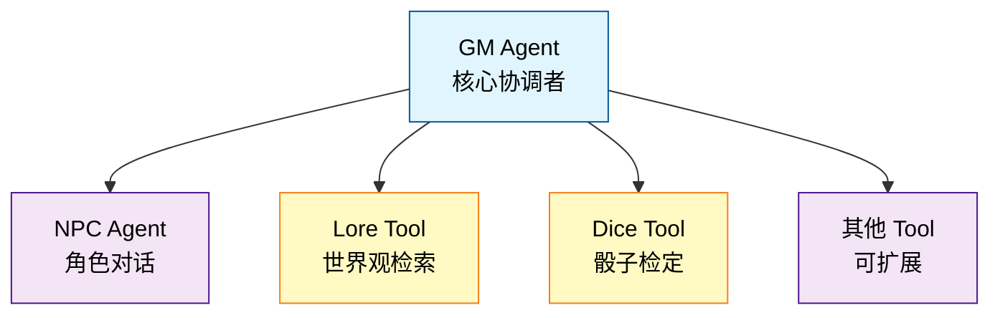
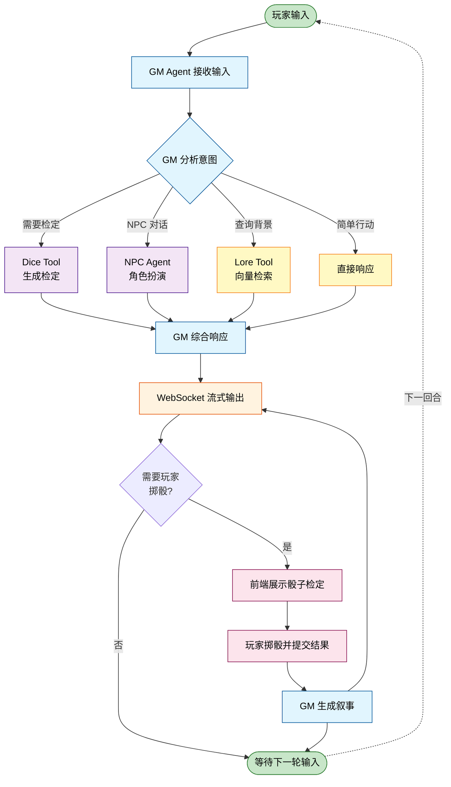

# Astinus

> AI 驱动的叙事向单人 TTRPG 引擎

Astinus 是一个基于 AI 多智能体架构的叙事导向桌面角色扮演游戏引擎，通过自然语言交互提供沉浸式的单人 TTRPG 体验。

## 项目状态

✅ MVP

## 快速开始

### 环境要求

- Node.js >= 20
- npm

### 安装

```bash
# 克隆仓库
git clone https://github.com/Rene-Zhou/Astinus.git
cd Astinus

# 安装所有依赖（后端 + 前端）
make install

# 或者分别安装
cd src/backend && npm install
cd src/web && npm install

# 复制配置模板
cp config/settings.example.yaml config/settings.yaml
# 编辑 config/settings.yaml 填入你的 API 密钥
```

### 启动开发服务器

#### 方式一：手动启动（推荐用于调试）

```bash
# 启动后端 API 服务器（终端 1）
cd src/backend && npm run dev

# 启动前端开发服务器（终端 2）
cd src/web && npm run dev
```

然后在浏览器中打开 `http://localhost:5173`

#### 方式二：使用 PM2 保活管理（推荐用于持续开发/部署）

```bash
# 安装 PM2（全局安装一次即可）
npm install -g pm2

# 使用配置文件启动前后端服务
pm2 start pm2.config.js

# 查看运行状态
pm2 status

# 查看实时日志
pm2 logs

# 停止所有服务
pm2 stop all
```

项目根目录的 `pm2.config.js` 配置了前后端进程的保活管理。

### 运行测试

```bash
# 运行所有测试
make test

# 运行后端测试
cd src/backend && npm test

# 运行前端测试
cd src/web && npm test

# 运行所有检查（lint + type-check + test）
make check
```

## 核心特性

- 🎭 **纯自然语言交互** - 无菜单选项，自由描述行动
- 🖥️ **现代化 Web 界面** - 基于 React 的响应式用户界面
  - 实时聊天窗口，流式显示叙事内容
  - 角色状态面板，动态展示游戏状态
  - 可视化骰子界面，动画掷骰结果
  - 响应式设计，支持桌面和移动端
- 📱 **移动端优化** - 专为移动设备优化的交互体验
  - 底部面板设计，触摸友好的界面
  - 自适应布局，手机平板完美适配
  - 防滚动锁定，流畅的移动体验
- 🤖 **多智能体协作** - GM、NPC 等 Agent 分工协作
  - GM Agent - 核心协调者，星型拓扑中心
  - NPC Agent - 角色对话，情感与关系系统
  - Lore Search - 通过 Tool Call 检索世界观与背景信息
- 🧠 **智能向量检索** - LanceDB 语义搜索
  - Lore 混合搜索：关键词 + 向量语义匹配
  - NPC 记忆检索：语义检索相关记忆
  - GM 历史检索：长游戏对话历史管理
- 🎲 **透明的规则系统** - 基于 2d6 的掷骰机制（掷 2d6，奖励/惩罚骰子取最高/最低 2 枚）
- 📦 **模块化世界包** - 故事内容与引擎解耦，支持扩展
- 🌏 **多语言支持** - 中英双语界面与内容
- ⚡ **实时流式交互** - WebSocket 流式输出，typewriter 效果
- 💾 **持久化存储** - SQLite 存档 + LanceDB 向量库

## Web 界面预览

Astinus 提供现代化的 Web 界面，可在任何现代浏览器中运行，支持桌面和移动设备：

### 游戏主界面

**桌面端 - 三栏布局**


**移动端 - 底部面板设计**


### 主要组件

**桌面端**:
- **左侧状态栏**: 显示角色信息、当前位置、游戏阶段和回合数
- **中间聊天区**: 实时显示 GM 叙事和玩家行动，流式内容输出
- **右侧骰子面板**: 可视化掷骰功能，动画显示结果
- **底部输入区**: 玩家输入框，支持多行文本和历史记录

**移动端**:
- **顶部对话区**: 全屏显示叙事内容，触摸滚动
- **底部工具栏**: 三个标签页（菜单、角色、骰子）
- **底部输入框**: 触摸优化的输入区域
- **底部面板**: 从底部滑出的功能面板

## 技术栈

### 后端
- **框架**: Hono - 轻量高性能 Web 框架
- **AI SDK**: Vercel AI SDK - 结构化输出与流式响应
- **Agent**: 多 Agent 协作系统（星型拓扑）
- **实时通信**: WebSocket - 流式响应

### 前端
- **框架**: React 19 - 现代化前端框架
- **语言**: TypeScript - 类型安全
- **构建工具**: Vite - 快速开发体验
- **样式**: TailwindCSS - 实用优先的 CSS 框架
- **状态管理**: Zustand - 轻量级状态管理
- **路由**: React Router v7 - 标准路由解决方案
- **测试**: Vitest + Testing Library - 快速测试

### 数据层
- **ORM**: Drizzle ORM + SQLite
- **向量检索**: LanceDB - 嵌入式向量数据库
- **验证**: Zod - 运行时类型验证
- **世界包**: JSON 格式，模块化管理

### 开发工具
- **包管理**: npm (monorepo)
- **测试**: Vitest
- **代码质量**: ESLint + Prettier
- **类型系统**: TypeScript (全栈)

## 架构设计

### Agent 星型拓扑



- **信息隔离**: 每个 Agent 只能访问必要的上下文切片
- **职责单一**: 每个 Agent 有明确的职责边界
- **可扩展**: 易于添加新的 Agent 类型

### Multi-Agent 循环

游戏回合通过以下循环流程运行：



**流程说明**:

1. **玩家输入阶段**: 玩家通过自然语言描述行动
2. **GM 意图分析**: 解析玩家意图，决定调用哪些 Tool/Agent
3. **Agent 协作处理**:
   - **NPC Agent**: 处理 NPC 对话，维护角色记忆和关系
   - **Lore Tool**: 通过工具调用检索相关世界观背景信息
   - **Dice Tool**: 判断是否需要骰子检定，生成检定请求
   - **Direct**: 简单行动直接响应，无需调用子 Agent
4. **GM 综合响应**: 整合所有 Agent 的输出，生成连贯叙事
5. **流式输出**: 通过 WebSocket 实时推送内容到前端
6. **骰子检定（可选）**: 如需检定，前端展示骰子界面，玩家掷骰后提交结果
7. **结果处理**: GM 根据骰子结果生成相应叙事
8. **循环继续**: 等待玩家下一轮输入

这种设计确保了：
- **响应及时**: GM 可以快速做出直接响应
- **规则透明**: 骰子检定过程对玩家可见
- **叙事连贯**: GM 负责统一所有 Agent 的输出
- **可扩展性**: 易于添加新的 Agent 类型

### 上下文切片机制

GM Agent 负责为每个子 Agent 准备精准的上下文切片，确保：
- NPC Agent 不会知道其他 NPC 的信息
- Lore Tool 只获取相关的世界观信息

## 许可证

本项目采用 MIT 许可证。详情请见 [LICENSE](LICENSE) 文件。

## 致谢

- 基于 Vercel AI SDK 构建 AI Agent 系统
- 在世界包的构建上，参考了[SillyTavern](https://github.com/SillyTavern/SillyTavern)的设计

## 联系方式

- 项目主页: [GitHub Repository](https://github.com/Rene-Zhou/Astinus)
- 问题反馈: [GitHub Issues](https://github.com/Rene-Zhou/Astinus/issues)
