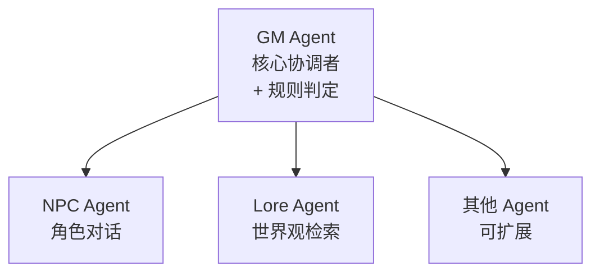

# Rule Agent 合并到 GM Agent 重构方案

**创建日期**: 2026-01-14
**状态**: 待实施
**目标**: 将 Rule Agent 的职责合并到 GM Agent，减少 LLM 调用次数和 ReAct 循环轮数

---

## 1. 背景与动机

### 1.1 现状问题

当前架构中，当玩家行动涉及风险时，处理流程如下：

```
玩家输入 → GM Agent (分析意图)
         → CALL_AGENT(rule)
         → Rule Agent (判断是否需要检定)
         → 返回 GM Agent
         → [如需检定] 暂停等待掷骰
         → 玩家掷骰
         → resume_after_dice
         → GM Agent (继续处理)
```

**问题**：
1. **额外的 LLM 调用**: 每次涉及风险的行动都需要额外调用 Rule Agent
2. **增加 ReAct 轮数**: GM 需要先调用 Rule Agent，再根据结果继续处理
3. **Token 消耗**: 两次 LLM 调用意味着双倍的上下文传输
4. **规则简单**: 2d6 骰子系统规则简单，GM 完全可以直接判断

### 1.2 重构目标

```
玩家输入 → GM Agent (分析意图 + 判断检定 + 生成 DiceCheckRequest)
         → [如需检定] 暂停等待掷骰
         → 玩家掷骰
         → resume_after_dice
         → GM Agent (继续处理)
```

**收益**：
- 减少 1 次 LLM 调用
- 减少 1 轮 ReAct 循环
- 降低 Token 消耗和延迟
- 简化代码维护

---

## 2. 当前架构分析

### 2.1 Rule Agent 职责

| 职责 | 实现位置 | 合并策略 |
|------|---------|---------|
| 判断是否需要检定 | `rule.py:process()` | 合并到 GM prompt |
| 评估特质影响 | `rule_agent.yaml` | 合并到 GM prompt |
| 评估标签影响 | `rule_agent.yaml` | 合并到 GM prompt |
| 生成 DiceCheckRequest | `rule.py:process()` | GM 直接生成 |
| 处理骰子结果叙事 | `rule.py:process_result()` | **已废弃，删除** |

### 2.2 Rule Agent 接收的上下文

来自 `gm.py:_slice_context_for_rule()`:

```python
{
    "action": player_input,
    "character": {
        "name": self.game_state.player.name,
        "concept": self.game_state.player.concept.model_dump(),
        "traits": [t.model_dump() for t in self.game_state.player.traits],
    },
    "tags": self.game_state.player.tags,
    "lang": lang,
}
```

### 2.3 Rule Agent 输出格式

```json
{
    "reasoning": "推理过程",
    "needs_check": true,
    "check_request": {
        "intention": "行动意图",
        "influencing_factors": {
            "traits": ["相关特质"],
            "tags": ["相关标签"]
        },
        "dice_formula": "2d6 或 3d6kh2 或 3d6kl2",
        "instructions": {
            "cn": "修正原因",
            "en": "Why modifiers apply"
        }
    }
}
```

### 2.4 涉及的文件

| 文件 | 改动类型 | 说明 |
|------|---------|------|
| `src/backend/agents/gm.py` | **修改** | 移除 Rule Agent 调用，添加检定判断逻辑 |
| `src/backend/agents/prompts/gm_agent.yaml` | **修改** | 添加角色信息 + 检定判断指南 |
| `src/backend/agents/rule.py` | **删除** | 整个文件 |
| `src/backend/agents/prompts/rule_agent.yaml` | **删除** | 整个文件 |
| `src/backend/agents/__init__.py` | **修改** | 移除 RuleAgent 导出 |
| `src/backend/main.py` | **修改** | 移除 RuleAgent 初始化 |
| `src/backend/core/config.py` | **修改** | 移除 rule agent 配置 |
| `src/backend/api/v1/settings.py` | **修改** | 移除 rule agent 相关代码 |
| `tests/backend/agents/test_rule.py` | **删除** | 整个文件 |
| `tests/backend/agents/test_rule_result.py` | **删除** | 整个文件 |

---

## 3. 详细重构步骤

### 3.1 Phase 1: 扩展 GM Agent Prompt

#### 3.1.1 添加角色信息到 GM 上下文

在 `gm_agent.yaml` 的 `context` 部分添加：

```yaml
# 在 "=== 游戏状态 ===" 之前添加

=== 玩家角色信息 ===
角色名：{{ player_character.name }}
概念：{{ player_character.concept }}

角色特质：

- {{ trait.name }}
  描述：{{ trait.description }}
  正面：{{ trait.positive }}（可论证获得优势）
  负面：{{ trait.negative }}（特定情况可能造成劣势）


当前状态标签：{{ player_character.tags | join('、') }}无

```

#### 3.1.2 添加检定判断指南

在 `gm_agent.yaml` 的 `guidelines` 或新增 `dice_check_rules` 部分：

```yaml
dice_check_rules: |
  【骰子检定判断规则】
  
  ## 何时需要检定
  - 简单无风险的行动不需要检定（如正常行走、观察、移动到相邻位置）
  - 有难度或风险的行动需要检定（如攀爬、说服、逃跑、战斗、潜行、威胁、欺骗）
  
  ## 如何判断优势/劣势
  1. 评估角色特质的【正面】是否对当前行动有利 → 给予优势 (3d6kh2)
  2. 评估角色特质的【负面】是否对当前行动不利 → 造成劣势 (3d6kl2)
  3. 检查角色的负面状态标签是否影响行动 → 造成劣势 (3d6kl2)
  4. 评估玩家提出的优势论证是否合理
  5. 优势和劣势可以相互抵消，最终只保留净效果
  
  ## 骰子公式
  - 普通检定：2d6
  - 优势检定：3d6kh2（掷3个骰子，保留最高的2个）
  - 劣势检定：3d6kl2（掷3个骰子，保留最低的2个）
```

#### 3.1.3 修改输出格式

扩展 RESPOND 动作的 JSON 格式，支持直接输出检定请求：

```yaml
task: |
  # ... 现有内容 ...
  
  返回严格的 JSON 格式（不要包含任何其他内容）：

  如果直接输出叙事（无需检定）：
  {
    "action": "RESPOND",
    "reasoning": "推理过程",
    "narrative": "叙事描述",
    "target_location": "目标位置ID或null"
  }

  如果需要骰子检定：
  {
    "action": "RESPOND",
    "reasoning": "推理过程：分析行动风险、评估特质/标签影响、确定骰子公式",
    "needs_check": true,
    "check_request": {
      "intention": "行动意图的简短描述",
      "influencing_factors": {
        "traits": ["影响此检定的相关特质"],
        "tags": ["影响此检定的相关标签"]
      },
      "dice_formula": "2d6 或 3d6kh2 或 3d6kl2",
      "instructions": {
        "cn": "为什么有这些修正",
        "en": "Why these modifiers apply"
      }
    },
    "narrative": "检定前的叙事（描述玩家准备行动的情景）"
  }

  如果需要调用子Agent（仅 NPC 或 Lore）：
  {
    "action": "CALL_AGENT",
    "reasoning": "推理过程",
    "agent_name": "npc_{id} 或 lore",
    "agent_context": { ... }
  }
```

### 3.2 Phase 2: 修改 GM Agent 代码

#### 3.2.1 修改 `_get_react_action` 方法

在 `gm.py` 中，更新模板变量以包含角色信息：

```python
# 在 template_vars 中添加
template_vars = {
    # ... 现有变量 ...
    
    # 新增：玩家角色信息
    "player_character": {
        "name": self.game_state.player.name,
        "concept": self.game_state.player.concept.get(lang),
        "traits": [
            {
                "name": t.name.get(lang),
                "description": t.description.get(lang),
                "positive": t.positive_aspect.get(lang),
                "negative": t.negative_aspect.get(lang),
            }
            for t in self.game_state.player.traits
        ],
        "tags": self.game_state.player.tags,
    },
}
```

#### 3.2.2 修改 `_run_react_loop` 方法

移除 `CALL_AGENT("rule")` 分支，改为直接处理检定：

```python
async def _run_react_loop(self, ...):
    # ... 现有代码 ...
    
    while iteration < max_iterations:
        action = await self._get_react_action(...)
        
        if action.action_type == GMActionType.RESPOND:
            # 检查是否需要骰子检定
            if action.agent_context.get("needs_check"):
                check_request = action.agent_context.get("check_request", {})
                narrative = action.content  # 检定前叙事
                
                # 保存 ReAct 状态
                self.game_state.save_react_state(
                    iteration=iteration + 1,
                    llm_messages=[],
                    player_input=player_input,
                    agent_results=agent_results,
                )
                
                self.game_state.set_phase(GamePhase.DICE_CHECK)
                
                return AgentResponse(
                    content=narrative,
                    success=True,
                    metadata={
                        "agent": self.agent_name,
                        "needs_check": True,
                        "dice_check": check_request,
                        "agents_called": agents_called,
                    },
                )
            
            # 普通响应（无检定）
            return self._finalize_response(...)
        
        elif action.action_type == GMActionType.CALL_AGENT:
            agent_name = action.agent_name
            
            # 移除对 rule agent 的处理
            # if agent_name == "rule":  # 删除这个分支
            
            if agent_name.startswith("npc_") or agent_name == "lore":
                # 现有的 NPC/Lore 处理逻辑
                ...
```

#### 3.2.3 修改 `GMAction` 解析

更新 `_get_react_action` 中的 JSON 解析逻辑：

```python
if action_str == "RESPOND":
    return GMAction(
        action_type=GMActionType.RESPOND,
        content=result.get("narrative", ""),
        agent_context={
            "target_location": result.get("target_location"),
            "needs_check": result.get("needs_check", False),  # 新增
            "check_request": result.get("check_request"),      # 新增
        },
        reasoning=result.get("reasoning", ""),
    )
```

#### 3.2.4 删除 Rule Agent 相关方法

从 `gm.py` 中删除：

```python
# 删除这个方法
def _slice_context_for_rule(self, player_input: str, lang: str) -> dict[str, Any]:
    ...

# 删除 _prepare_agent_context 中的 rule 分支
def _prepare_agent_context(self, agent_name: str, ...):
    # if agent_name == "rule":  # 删除
    #     return self._slice_context_for_rule(...)
    ...
```

### 3.3 Phase 3: 清理代码

#### 3.3.1 删除文件

```bash
# 删除 Rule Agent 实现
rm src/backend/agents/rule.py
rm src/backend/agents/prompts/rule_agent.yaml

# 删除测试文件
rm tests/backend/agents/test_rule.py
rm tests/backend/agents/test_rule_result.py
```

#### 3.3.2 修改 `__init__.py`

```python
# src/backend/agents/__init__.py
"""Astinus agent modules."""

from src.backend.agents.base import AgentResponse, BaseAgent
from src.backend.agents.director import DirectorAgent
from src.backend.agents.gm import GMAgent
from src.backend.agents.lore import LoreAgent
from src.backend.agents.npc import NPCAgent
# 删除: from src.backend.agents.rule import RuleAgent

__all__ = [
    "AgentResponse",
    "BaseAgent",
    "DirectorAgent",
    "GMAgent",
    "LoreAgent",
    "NPCAgent",
    # 删除: "RuleAgent",
]
```

#### 3.3.3 修改 `main.py`

```python
# 删除导入
# from src.backend.agents.rule import RuleAgent

# 删除初始化代码
# rule_agent = RuleAgent(llm)

# 修改 sub_agents 字典
sub_agents: dict = {
    # "rule": rule_agent,  # 删除
    "lore": lore_agent,
    "npc": npc_agent,
}
```

#### 3.3.4 修改 `config.py`

```python
# 删除 AgentsConfig 中的 rule 字段
class AgentsConfig(BaseModel):
    gm: AgentConfig
    npc: AgentConfig
    # rule: AgentConfig  # 删除
    lore: AgentConfig

# 删除 AgentModelsConfig 中的 rule 字段
class AgentModelsConfig(BaseModel):
    gm: str = Field(default="gpt-4o-mini")
    npc: str = Field(default="gpt-4o-mini")
    # rule: str = Field(default="gpt-4o-mini")  # 删除
    lore: str = Field(default="gpt-4o-mini")

# 更新默认配置生成逻辑
for agent_name in ["gm", "npc", "lore"]:  # 移除 "rule"
    ...
```

#### 3.3.5 修改 `api/v1/settings.py`

```python
# 删除 AgentsResponse 中的 rule 字段
class AgentsResponse(BaseModel):
    gm: AgentConfigResponse
    npc: AgentConfigResponse
    # rule: AgentConfigResponse  # 删除
    lore: AgentConfigResponse

# 删除 AgentsUpdate 中的 rule 字段
class AgentsUpdate(BaseModel):
    gm: AgentInput | None = None
    npc: AgentInput | None = None
    # rule: AgentInput | None = None  # 删除
    lore: AgentInput | None = None

# 更新相关的处理逻辑
for agent_name in ["gm", "npc", "lore"]:  # 移除 "rule"
    ...

# 删除 _reinitialize_gm_agent 中的 RuleAgent 创建
# rule_agent = RuleAgent(llm)  # 删除
```

### 3.4 Phase 4: 更新测试

#### 3.4.1 修改 GM Agent 测试

更新 `tests/backend/agents/test_gm.py`（如存在）以测试新的检定逻辑：

```python
@pytest.mark.asyncio
async def test_gm_generates_dice_check(gm_agent, mock_llm):
    """Test GM Agent generates dice check directly."""
    mock_llm.ainvoke.return_value = AIMessage(
        content="""{
            "action": "RESPOND",
            "reasoning": "玩家尝试逃跑，需要检定",
            "needs_check": true,
            "check_request": {
                "intention": "逃离房间",
                "influencing_factors": {
                    "traits": [],
                    "tags": ["右腿受伤"]
                },
                "dice_formula": "3d6kl2",
                "instructions": {
                    "cn": "腿伤导致劣势",
                    "en": "Leg injury causes disadvantage"
                }
            },
            "narrative": "你准备逃离这个房间..."
        }"""
    )
    
    result = await gm_agent.process({"player_input": "我要逃跑"})
    
    assert result.success is True
    assert result.metadata.get("needs_check") is True
    assert "dice_check" in result.metadata
```

### 3.5 Phase 5: 更新文档

#### 3.5.1 更新 ARCHITECTURE.md

移除 Rule Agent 相关描述，更新架构图：



#### 3.5.2 更新 README.md

修改多智能体协作部分的描述。

#### 3.5.3 更新 AGENTS.md

移除 Rule Agent 相关内容。

---

## 4. 实施清单

### 4.1 代码改动清单

- [ ] **Phase 1: Prompt 扩展**
  - [ ] 修改 `gm_agent.yaml` - 添加角色信息上下文
  - [ ] 修改 `gm_agent.yaml` - 添加检定判断规则
  - [ ] 修改 `gm_agent.yaml` - 扩展输出格式支持 `needs_check`

- [ ] **Phase 2: GM Agent 代码修改**
  - [ ] 修改 `gm.py:_get_react_action()` - 添加 player_character 变量
  - [ ] 修改 `gm.py:_run_react_loop()` - 处理 RESPOND + needs_check
  - [ ] 修改 `gm.py:_get_react_action()` - 更新 JSON 解析
  - [ ] 删除 `gm.py:_slice_context_for_rule()` 方法
  - [ ] 修改 `gm.py:_prepare_agent_context()` - 移除 rule 分支

- [ ] **Phase 3: 清理代码**
  - [ ] 删除 `src/backend/agents/rule.py`
  - [ ] 删除 `src/backend/agents/prompts/rule_agent.yaml`
  - [ ] 修改 `src/backend/agents/__init__.py`
  - [ ] 修改 `src/backend/main.py`
  - [ ] 修改 `src/backend/core/config.py`
  - [ ] 修改 `src/backend/api/v1/settings.py`
  - [ ] 删除 `tests/backend/agents/test_rule.py`
  - [ ] 删除 `tests/backend/agents/test_rule_result.py`

- [ ] **Phase 4: 更新测试**
  - [ ] 添加/修改 GM Agent 检定测试

- [ ] **Phase 5: 更新文档**
  - [ ] 更新 `docs/ARCHITECTURE.md`
  - [ ] 更新 `README.md`
  - [ ] 更新 `src/backend/agents/AGENTS.md`
  - [ ] 更新 `AGENTS.md` (项目根目录)

### 4.2 验证清单

- [ ] `uv run pytest` - 所有测试通过
- [ ] `uv run ruff check src/` - 无 lint 错误
- [ ] `uv run mypy src/` - 无类型错误
- [ ] 手动测试：简单行动（无检定）正常响应
- [ ] 手动测试：风险行动触发骰子检定
- [ ] 手动测试：优势/劣势正确应用
- [ ] 手动测试：掷骰后正确恢复 ReAct 循环

---

## 5. 风险与回滚

### 5.1 风险评估

| 风险 | 可能性 | 影响 | 缓解措施 |
|------|--------|------|---------|
| GM prompt 过长导致性能下降 | 低 | 中 | 监控 token 使用，必要时优化 |
| 检定判断不如专用 Agent 准确 | 低 | 中 | 详细的 prompt 指南，保留所有判断逻辑 |
| 遗漏某些 Rule Agent 功能 | 低 | 高 | 仔细审查 Rule Agent 代码 |

### 5.2 回滚方案

如需回滚，可通过 git 恢复：
```bash
git revert <commit-hash>
```

建议在单独的 feature 分支上实施重构：
```bash
git checkout -b refactor/merge-rule-agent
```

---

## 6. 附录

### 6.1 完整的 Rule Agent 判断逻辑（供参考）

从 `rule_agent.yaml` 提取的完整判断规则：

```yaml
guidelines:
  - 简单无风险的行动不需要检定（如正常行走）
  - 有难度或风险的行动需要检定（如攀爬、说服、逃跑）
  - 评估特质的【正面】是否对当前行动有利 → 可给予优势
  - 评估特质的【负面】是否对当前行动不利 → 可能造成劣势
  - 检查角色的负面标签（tags）是否造成劣势
  - 评估玩家提出的优势论证是否合理
  - 只关注规则判定，不进行叙事
```

### 6.2 DiceCheckRequest 模型（保持不变）

```python
class DiceCheckRequest(BaseModel):
    intention: str
    influencing_factors: dict[str, list[str]]
    dice_formula: str
    instructions: LocalizedString
```

此模型保持不变，由 GM Agent 直接生成。
